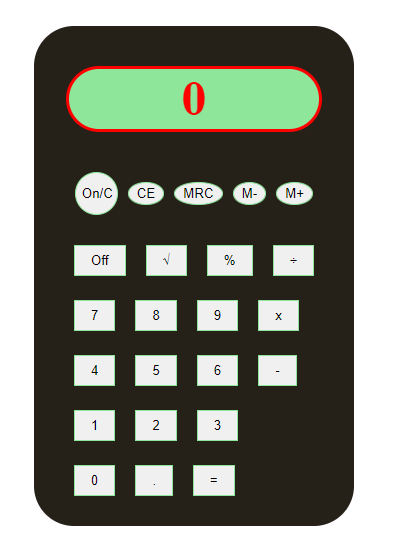

# CalculatorJS


## Sobre o projeto

CalculatorJS é uma calculadora que usa elementos da Dom para realizar cálculos básicos, assim como uma calculadora de bolso comum. 

<br>

### Layout Console



<br>

## Tecnologias utilizadas

### Front-End
* HTML / CSS / JS

<br>

## Como executar o projeto
```bash
# clonar repositório
git clone git@github.com:maxsueldev/CalculatorJS.git

# entrar na pasta do projeto e abrir o arquivo index.html
```

<br>

## Autor
Maxsuel Santos

<https://www.linkedin.com/in/maxsuelfernandob/>
